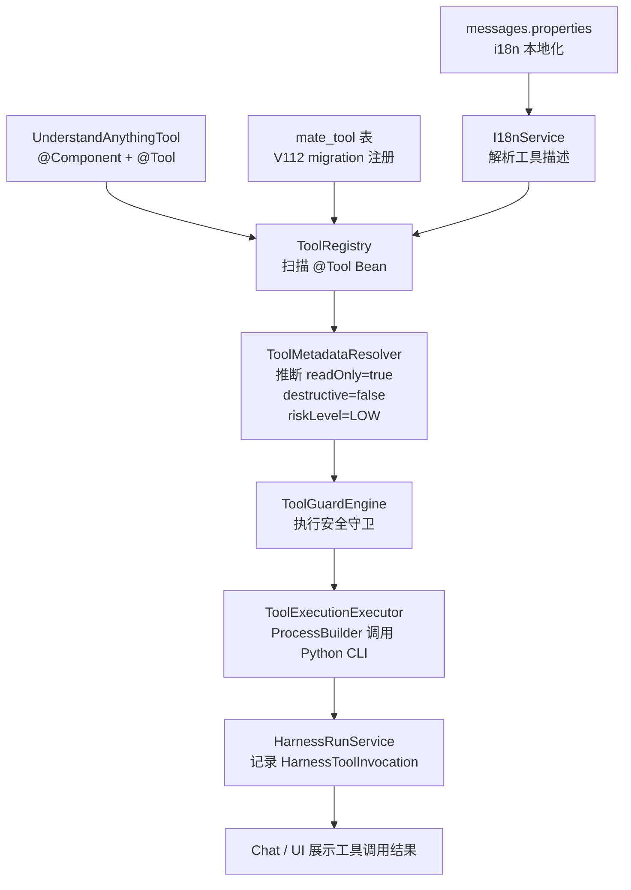
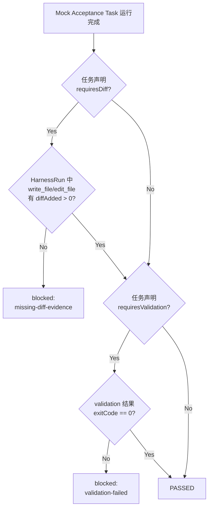
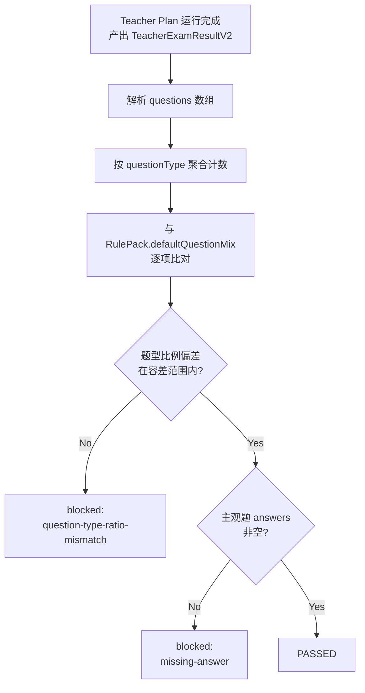

## 产品概述

本次任务包含两条并行工作线：

**工作线 A - P1 阻塞项闭环**：推动 Coding Agent 和 Teacher Exam Assistant 两个内置 Agent 的所有 P1 阻塞项从 `in_progress` 状态闭环，将验收评分从启发式升级为硬门控（hard gate），并同步更新实施台账。

**工作线 B - Understand-Anything 工具集成**：将开源 Python CLI 工具 Understand-Anything 作为内置 @Tool Bean 集成到 MateClaw 工具系统中，以此验证工具定义→注册→审批守卫→Harness 追踪→i18n 本地化的全链路完整性，建立一套可复用的外部 CLI 工具集成模式。

## 核心功能

### 工作线 A：P1 阻塞项闭环

- **Coding Agent 验收硬化**：在 HarnessRunService 中将 diff-aware 断言升级为硬门控——mutation-required 任务必须有 diff 证据、validation-required 任务必须有 exitCode=0 的验证结果，否则直接 block
- **Teacher Agent 验收硬化**：在 TeacherAcceptanceService 中新增 section-aware rubric 检查——按题块验证题型比例、分值规范、答案采分点完整性，缺失即 block
- **Phase 5 上下文路由预算深化**：ContextRouterService 接入字符级精确预算裁剪，WikiContextService 增加命中片段压缩
- **Phase 6 Profile/Capability 运行时消费者**：AgentGraphBuilder 在构建时读取 template manifest 中的 capabilityPack，将 capability 声明注入为运行时工具筛选输入
- **台账同步**：在 agent-harness-implementation.md 中新增 "P1 Closure Blockers" 章节，逐条记录闭环状态

### 工作线 B：Understand-Anything 工具集成

- **UnderstandAnythingTool**：@Tool Bean 通过 ProcessBuilder 调用 Python `understand-anything` CLI，支持 `/understand-code` 命令，输出结构化 JSON
- **DB 注册**：通过 V112 migration 写入 mate_tool 表（name=understand_code, beanName=understandAnythingTool, toolType=builtin）
- **i18n 本地化**：中英文 tool 描述、参数描述注册到 messages.properties
- **全链路验证**：确认工具被 ToolRegistry 自动发现、ToolMetadataResolver 正确推断 readOnly 元数据、ToolGuardEngine 审批策略生效、HarnessRunService 追踪工具调用

## 技术栈

- 后端：Java 21 + Spring Boot 3.5.13 + Spring AI 1.1.4 + MyBatis-Plus 3.5.16
- 外部进程：Python 3.10+ CLI（Understand-Anything），通过 ProcessBuilder 调用
- 数据库：MySQL 8.0（Flyway migration V112）
- i18n：messages.properties / messages_en.properties

## 实现方案

### 工作线 A：P1 阻塞项闭环

#### A1. Coding Agent - Diff-aware 硬门控

**策略**：在 HarnessRunService 的 mock acceptance 评分流程中，为 Coding Agent 添加硬阻塞逻辑——当任务声明 `requiresDiff=true` 但 HarnessToolInvocation 中 `edit_file`/`write_file` 工具的 trace 未产出 `diffAdded > 0` 时，直接标记 `blocked: "missing-diff-evidence"`；当任务声明 `requiresValidation=true` 但 validation 结果 `exitCode != 0` 时，直接标记 `blocked: "validation-failed"`。

**关键决策**：当前 scoring 已有 evidence extraction（patch file counts、validation exit codes），需增加 blocking gate 层，将 existing evidence 从未强制要求升级为硬条件。

#### A2. Teacher Agent - Section-aware Rubric 硬门控

**策略**：在 TeacherAcceptanceService 中新增按 RulePack 题型结构做分块校验——例如名著 RulePack 要求填空 10%/选择 20%/简答 15%/分析 30%/探究 25%，则解析 teacher_exam_result_v2 的 questions 数组，按题型聚合后检查比例偏差是否在容差范围内。偏差超容差直接 block。

**关键决策**：利用现有 TeacherExamResultV2 结构化输出和 `TeacherRulePack.questionTypeRules` 中已声明的 `defaultQuestionMix`，从 prompt-only 约束升级为 post-hoc gate enforcement。

#### A3. Phase 5 - Token 预算与片段压缩

**策略**：在 ContextRouterService 的 `buildQueryAwareContext` 方法中，从字符预算改为按模型 tokenizer 近似计数（1 token per 3.5 chars as fallback），并在 WikiContextService 中为检索命中片段增加 truncation（取首尾关键句中间省略）。

#### A4. Phase 6 - Profile/Capability 运行时消费

**策略**：在 AgentGraphBuilder 构建 agent 时，已读取 template manifest 中的 capabilityPack。新增逻辑：将 capability 声明（如 `market_data_aggregation`、`technical_analysis`）转换为 `AgentToolSet` 的 tool filter hints，使 Agent 运行时的工具可见集与模板能力声明对齐。

### 工作线 B：Understand-Anything 工具集成

#### B1. 工具设计 - 复用 ShellExecuteTool 模式

**策略**：创建 `UnderstandAnythingTool.java`（@Component + @Tool 注解），核心方法 `understand_code(String repoPath, String query)` 通过 ProcessBuilder 执行 `python -m understand_anything /understand-code <repoPath>`，redirectOutput 到临时文件，超时默认 120s，输出截断 20KB。使用 `@ConcurrencyUnsafe` 标注（外部进程不可推理并发安全）。

**关键决策**：

- 工具名 `understand_code` — 符合 MetadataResolver 的 `read_only_prefixes`（`inspect_*`），自动推断为 readOnly=true
- riskLevel 通过方法名自动推断为 LOW（readOnly + builtin）
- 超时 120s（代码分析任务比 shell 命令耗时长）

#### B2. 数据库注册

**策略**：创建 V112__understand_anything_tool.sql migration，INSERT INTO mate_tool（toolType=builtin, beanName=understandAnythingTool, enabled=true, bindable=true, builtin=true）。

#### B3. i18n 本地化

**策略**：在 messages.properties 中添加 `tool.understand_code.desc`（中文描述）和 `tool.understand_code.param.repoPath`、`tool.understand_code.param.query` 的参数描述；在 messages_en.properties 中添加对应英文。

#### B4. 全链路验证清单

验证工具在以下每个环节都被正确处理：

1. ToolRegistry.getEnabledToolBeansByName() — 扫描到 @Tool 方法
2. ToolMetadataResolver — readOnly=true, destructive=false, riskLevel=LOW
3. ToolGuardEngine — 因 readOnly 不触发审批（除非 workspace policy 有额外限制）
4. HarnessRunService — 工具调用记录到 HarnessToolInvocation
5. mate_tool DB — beanName 映射正确
6. I18nService — 中英文描述正确返回

## 实现细节

### 文件变更清单

```
docs/
└── agent-harness-implementation.md     # [MODIFY] 新增 "P1 Closure Blockers" 章节，
                                        #   更新 P1 Checklist 状态

mateclaw-server/src/main/java/vip/mate/
├── tool/builtin/
│   └── UnderstandAnythingTool.java     # [NEW] @Tool Bean，调用 Python CLI
├── harness/service/
│   └── HarnessRunService.java          # [MODIFY] Coding Agent diff-aware /
│                                        #   validation-required 硬门控
├── teacher/service/
│   └── TeacherAcceptanceService.java   # [MODIFY] 新增 section-aware rubric
│                                        #   enforcement（题型比例、分值规范）
├── agent/context/
│   └── ContextRouterService.java       # [MODIFY] 字符预算升级为近似 token 预算
├── wiki/service/
│   └── WikiContextService.java         # [MODIFY] 检索命中片段压缩
├── agent/
│   └── AgentGraphBuilder.java          # [MODIFY] capabilityPack 声明注入
│                                        #   为运行时工具筛选输入
└── i18n/
    └── I18nService.java                # [MODIFY] 确认 tool.understand_code 的
                                        #   i18n 解析路径

mateclaw-server/src/main/resources/
├── messages.properties                  # [MODIFY] 新增 tool.understand_code.desc 等
├── messages_en.properties              # [MODIFY] 新增英文工具描述
└── db/migration/
    ├── mysql/
    │   └── V112__understand_anything_tool.sql  # [NEW] INSERT INTO mate_tool
    └── h2/
        └── V112__understand_anything_tool.sql  # [NEW] H2 兼容迁移
```

## 架构设计

### 工具集成全链路



### Coding Agent 硬门控流程



### Teacher 章节感知校验流程

